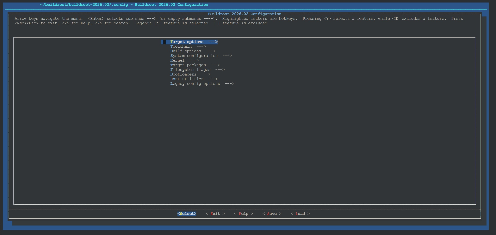
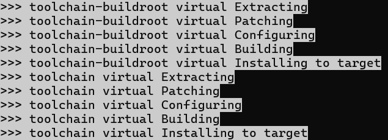

# zte-4g-portable-wifi-gcc-and-dynamically-linked-binaries  
中兴4G随身WiFi交叉编译器和动态链接工具/ zte-4g-portable-wifi-gcc-and-dynamically-linked-binaries  
本工具目前只在f30a pro上测试过，其他设备请自行适配！！！  
[123网盘备份](https://www.123pan.com/s/NV4Qjv-IZYvd)  
### 开启adb  
http://192.168.0.1/goform/goform_set_cmd_process?goformId=SET_DEVICE_MODE&debug_enable=1  
### 关闭adb  
http://192.168.0.1/goform/goform_set_cmd_process?goformId=SET_DEVICE_MODE&debug_enable=0  
## 编译buildroot交叉编译器arm-buildroot-linux-uclibcgnueabi-gcc-4.9.3  
动态编译出来的二进制elf体积较小，但是需要和运行环境匹配的so库、头文件和crt*.o启动文件。后二者在随身wifi系统里并不存在。我通过反编译、读取符号和编译运行c程序，推测原来的c库配置。最终buildroot编译出的c库和设备c库，二者不共有的符号控制在两位数（不完全一致，所以编译出的elf有可能段错误）。  
### ➤下载源码和配置
在这个网站下载Buildroot源码：https://buildroot.org  
选取buildroot-2015.11.1，它是最后一个官方支持uClibc-0.9.33.2的版本。  
当前路径是`~/buildroot`  
如果没有，创建并转到这个文件夹：`mkdir -p ~/buildroot;cd ~/buildroot`  
获取buildroot源码：`wget https://buildroot.org/downloads/buildroot-2015.11.1.tar.gz`  
解压并转到解压后的路径：`tar -xzvf buildroot-2015.11.1.tar.gz;cd ./buildroot-2015.11.1`  
可能需要：改extra/config/lxdialog/check-lxdialog.sh里的`main() {}`为`int main() { return 0; }`  
配置：`make menuconfig`  
界面如下，纯键盘操作  
<div align="left"></div>  

➤Target options  
◉Target Architecture: ARM (little endian)  
◉Target Architecture Variant: cortex-A7(这一版的buildroot还没有添加A53选项，只能在编译时往CFLAGS和LDFLAGS里添加-mcpu=cortex-a53 -mtune=cortex-a53)  
◉Target ABI: EABI (没有hf后缀)  
◉Floating point strategy: Soft float (-mfloat-abi=soft，内核没有硬件浮点支持，不确定处理器本身是否支持)  
◉ARM instruction set: Thumb2(对应-mthumb)  
➤Toolchain  
◉Kernel Headers：选择Manually specified Linux version  
◉linux version：输入3.4.110(内核版本是3.4.110-rt140)  
◉Custom kernel headers series：选择3.4.x  
◉C library: 选择uClibc  
◉uClibc C library Version：选择uClibc 0.9.33.x（我看过.config，2015.11.1默认用0.9.33.2版的）  
◉uClibc configuration file to use?：输入package/uclibc/uClibc-0.9.33.2.config（下载[uClibc-0.9.33.2.config](https://github.com/riuzenn/zte-4g-portable-wifi-advanced-webui/blob/main/uClibc-0.9.33.2.config)推送到~/buildroot/buildroot-2015.11.1/package/uclibc）  
◉Enable RPC support：勾选（按y）  
◉Enable WCHAR support：勾选  
◉Enable stack protection support：勾选(对应-fstack-protector-strong，如不需要栈保护则-fno-stack-protector)  
◉Enable compiler link-time-optimization support：勾选(对应-flto=$(nproc))  
```
link-time-optimization可不启用。若不启用，makefile里的命令需要如下更改：
AR和RANLIB使用没gcc字样版的（若编译时出错）
export AR="${CROSS_COMPILE}ar"
export RANLIB="${CROSS_COMPILE}ranlib"
CFLAGS和LDFLAGS里去除-flto=$(nproc)（若有）
```
普通用户不用管以下几行代码  
```
apt-get install -y rsync bc
sudo cp -r ~/buildroot /buildroot
sudo chown -R $(whoami):$(whoami) /buildroot
cd /buildroot/buildroot-2015.11.1
cp /buildroot/buildroot-2015.11.1/output/images/arm-buildroot-linux-uclibcgnueabi_sdk-buildroot.tar.gz ~/buildroot
```
### ➤编译Buildroot交叉编译器：`make -j$(nproc) toolchain`  
buildroot会去国外网站下源码，国内网络直连速度非常慢，记得...  
wsl2用上了全部12线程，不算debug时间，编译时间10分钟，牛逼。之前用cloud shell要几个小时，过的是什么苦日子。  
看到`>>> toolchain virtual Installing to target`就成了  
<div></div>  

可能需要：  
buildroot-2015.11.1太老了，在宿主机编译可能有SIGSTKSZ定义变化问题，可以考虑用docker  
```
sudo apt install -y docker.io
sudo usermod -aG docker $USER
newgrp docker
docker run --rm -it     -v /home/展开为用户名/buildroot:/home/展开为用户名/buildroot     ubuntu:18.04
cd /home/展开为用户名/buildroot/buildroot-2015.11.1
apt-get update
apt install -y build-essential python unzip rsync bc wget cpio file
exit
sudo chown -R $(whoami):$(whoami) ~/buildroot
```
如果启用了Toolchain→Enable C++ support：  
```
#报错的时候执行  
make host-gcc-final  
make host-gcc-final CXXFLAGS="-std=gnu++03"  
make host-gcc-final CXXFLAGS="-std=gnu++11"  
```
### ➤打包(位于./output/host/usr)、解压编译器，也就是挪个地  
打包编译器：`cd output/host;tar -cJf toolchain-backup.tar.xz usr`  
备份：`cp toolchain-backup.tar.gz ~`  
解压到~：`tar -xJf toolchain-backup.tar.xz -C ~`  
查看生成的编译器硬编码参数：`cd ~;./usr/bin/arm-buildroot-linux-uclibcgnueabi-gcc -v`  
将编译器路径写入用户变量：  
`echo 'export PATH=$PATH:~/usr/bin' >> ~/.bashrc`  
`source ~/.bashrc`  
把随身wifi的lib目录下的所有文件复制到编译电脑的~/usr/ztelib路径（建议通过adb pull或cp -rL等方式将软链接转换成实际文件）。  
### ➤如何使用现成的编译器
下载我编译好的[arm-buildroot-linux-uclibcgnueabi-gcc-4.9.3.tar.xz](https://github.com/riuzenn/zte-4g-portable-wifi-gcc-and-dynamically-linked-binaries/blob/main/arm-buildroot-linux-uclibcgnueabi-gcc-4.9.3.tar.xz)  
`cd ~`  
`tar -xJvf arm-buildroot-linux-uclibcgnueabi-gcc-4.9.3.tar.xz`  
## 以下介绍我基于该交叉编译器编译的动态链接工具  
### ◉at  
我重写了libatutils库里的几个函数，彻底不打印无关日志。受cvghh@酷安启发，用第二个参数控制输出格式，为1时打印"_返回字符串_"方便正则匹配。  
原来：  
<div align="left"></div>  

现在：  
<div align="left"></div>  

### ◉dropbear和sftp-server  
dropbear只保留curve25519、ed25519、chacha20-poly1305、sha2-256算法。  

### ◉curl、h2t和j2t  
curl保留http(s)、tls 1.2和1.3。可以手搓ai大模型的请求命令，利用curl调用api。  
<div align="left"></div>  

h2t提取html源码的标签文本并打印：  
<div align="left"></div>

j2t提取json里的键值对文本并打印。

### ◉类vim快捷键的neatvi、sfm文件管理器、less分页阅读器  
### ◉调试类：readelf、strace、dmesg、hexdump、strings  
### ◉其他：nslookup、tree、dtach、vmstat  


