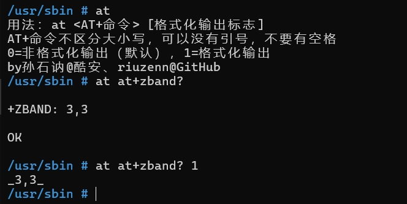
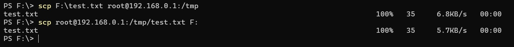
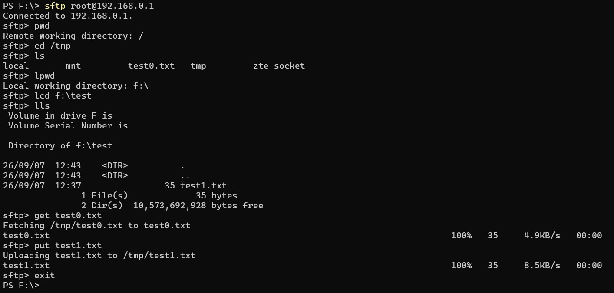
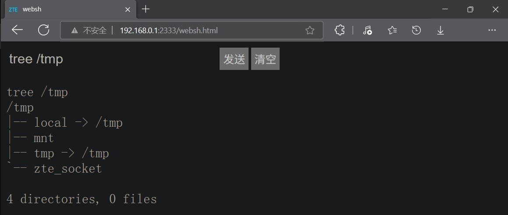
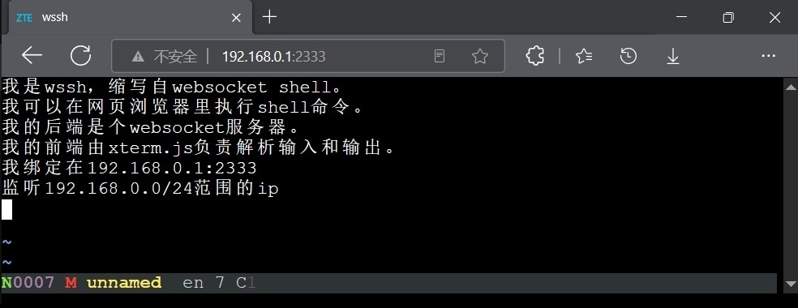
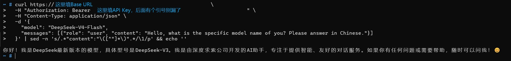
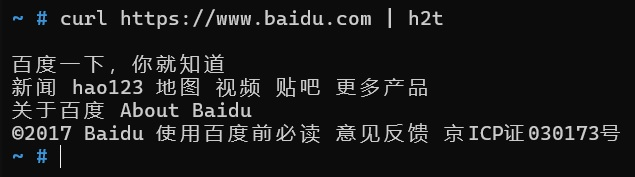
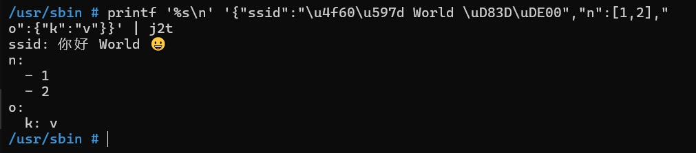
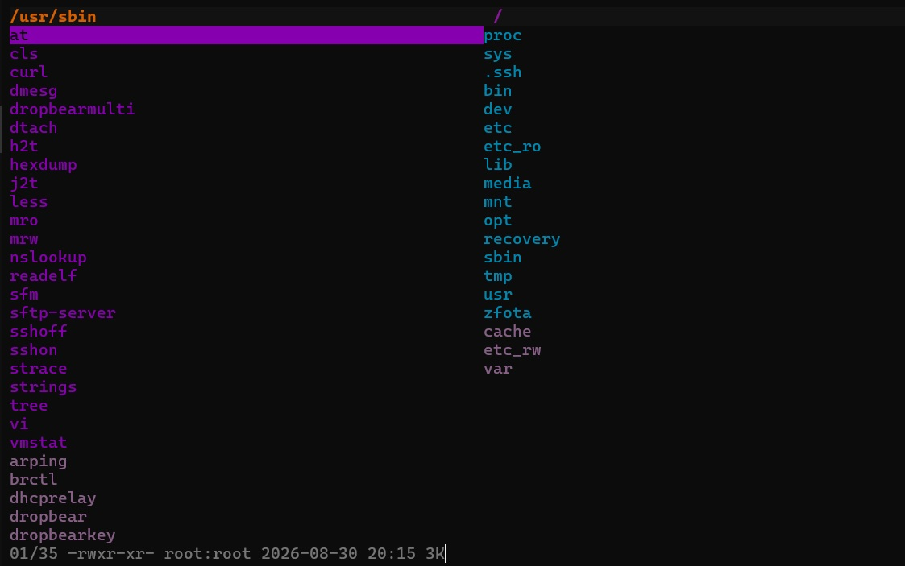
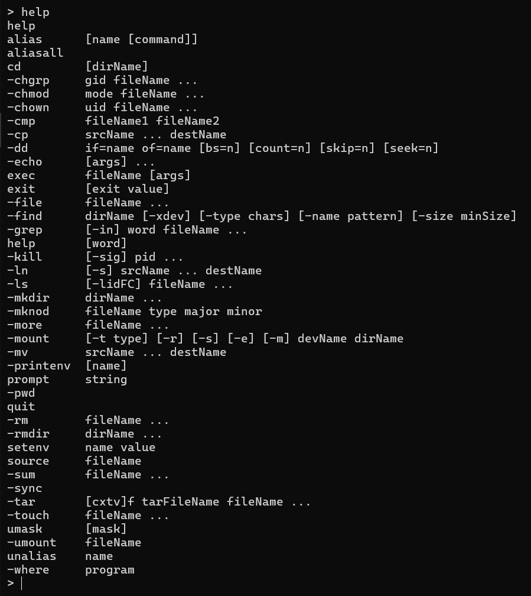

# zte-4g-portable-wifi-gcc-and-dynamically-linked-binaries  
中兴4G随身WiFi交叉编译器和动态链接工具/ zte-4g-portable-wifi-gcc-and-dynamically-linked-binaries  
本工具目前只在f30a pro上测试过，其他设备请自行适配！！！  
[123网盘备份](https://www.123pan.com/s/NV4Qjv-IZYvd)  
### 开启adb  
http://192.168.0.1/goform/goform_set_cmd_process?goformId=SET_DEVICE_MODE&debug_enable=1  
### 关闭adb  
http://192.168.0.1/goform/goform_set_cmd_process?goformId=SET_DEVICE_MODE&debug_enable=0  
## § 编译buildroot交叉编译器arm-buildroot-linux-uclibcgnueabi-gcc-4.9.3  
动态编译出来的二进制elf体积较小，但是需要和运行环境匹配的so库、头文件和crt*.o启动文件。后二者在随身wifi系统里并不存在。我通过反编译、读取符号和编译运行c程序，推测原来的c库配置。最终用buildroot编译出的c库和设备c库，二者不共有的符号控制在两位数（不完全一致，所以编译出的elf有可能段错误）。  
### ➤下载源码和配置
在这个网站下载Buildroot源码：https://buildroot.org  
选取buildroot-2015.11.1，它是最后一个官方支持uClibc-0.9.33.2的版本。  
当前路径是`~/buildroot`  
如果没有，创建并转到这个文件夹：`mkdir -p ~/buildroot;cd ~/buildroot`  
获取buildroot源码：`wget https://buildroot.org/downloads/buildroot-2015.11.1.tar.gz`  
解压并转到解压后的路径：`tar -xzvf buildroot-2015.11.1.tar.gz;cd ./buildroot-2015.11.1`  
可能需要：改extra/config/lxdialog/check-lxdialog.sh里的`main() {}`为`int main() { return 0; }`  
配置：`make menuconfig`  
界面如下，纯键盘操作  
<div align="left"></div>  

➤Target options  
◉Target Architecture: ARM (little endian)  
◉Target Architecture Variant: cortex-A7(这一版的buildroot还没有添加A53选项，只能在编译时往CFLAGS和LDFLAGS里添加-mcpu=cortex-a53 -mtune=cortex-a53)  
◉Target ABI: EABI (没有hf后缀)  
◉Floating point strategy: Soft float (对应-mfloat-abi=soft，内核没有硬件浮点支持，不确定处理器本身是否支持)  
◉ARM instruction set: Thumb2(对应-mthumb)  
➤Toolchain  
◉Kernel Headers：选择Manually specified Linux version  
◉linux version：输入3.4.110(内核版本是3.4.110-rt140)  
◉Custom kernel headers series：选择3.4.x  
◉C library: 选择uClibc  
◉uClibc C library Version：选择uClibc 0.9.33.x（我看过.config，2015.11.1默认用0.9.33.2版的）  
◉uClibc configuration file to use?：输入package/uclibc/uClibc-0.9.33.2.config（下载[uClibc-0.9.33.2.config](./源码/uClibc-0.9.33.2.config)推送到~/buildroot/buildroot-2015.11.1/package/uclibc）  
◉Enable RPC support：勾选（按y）  
◉Enable WCHAR support：勾选  
◉Enable stack protection support：勾选(对应-fstack-protector-strong，如不需要栈保护则-fno-stack-protector)  
◉Enable compiler link-time-optimization support：勾选(对应-flto=$(nproc))  
```
link-time-optimization可不启用。若不启用，makefile里的命令需要如下更改：
AR和RANLIB使用没gcc字样版的（若编译时出错）
export AR="${CROSS_COMPILE}ar"
export RANLIB="${CROSS_COMPILE}ranlib"
CFLAGS和LDFLAGS里去除-flto=$(nproc)（若有）
```
普通用户不用管以下几行代码  
```
apt-get install -y rsync bc
sudo cp -r ~/buildroot /buildroot
sudo chown -R $(whoami):$(whoami) /buildroot
cd /buildroot/buildroot-2015.11.1
cp /buildroot/buildroot-2015.11.1/output/images/arm-buildroot-linux-uclibcgnueabi_sdk-buildroot.tar.gz ~/buildroot
```
### ➤编译Buildroot交叉编译器：`make -j$(nproc) toolchain`  
buildroot会去国外网站下源码，国内网络直连速度非常慢，记得...  
wsl2用上了全部12线程，不算debug时间，编译时间10分钟，牛逼。之前用cloud shell要几个小时，过的是什么苦日子。  
看到`>>> toolchain virtual Installing to target`就成了  
<div></div>  

可能需要：  
buildroot-2015.11.1太老了，在宿主机编译可能有SIGSTKSZ定义变化问题，可以考虑用docker  
```
sudo apt install -y docker.io
sudo usermod -aG docker $USER
newgrp docker
docker run --rm -it     -v /home/展开为用户名/buildroot:/home/展开为用户名/buildroot     ubuntu:18.04
cd /home/展开为用户名/buildroot/buildroot-2015.11.1
apt-get update
apt install -y build-essential python unzip rsync bc wget cpio file
exit
sudo chown -R $(whoami):$(whoami) ~/buildroot
```
如果启用了Toolchain→Enable C++ support：  
```
#第一次报错执行  
make host-gcc-final
#第二次报错执行  
make host-gcc-final CXXFLAGS="-std=gnu++03"
#第三次报错执行  
make host-gcc-final CXXFLAGS="-std=gnu++11"  
```
### ➤打包(位于./output/host/usr)、解压编译器，也就是挪个地  
打包编译器：`cd output/host;tar -cJf toolchain-backup.tar.xz usr`  
备份：`cp toolchain-backup.tar.xz ~`  
解压到~：`tar -xJf toolchain-backup.tar.xz -C ~`  
查看生成的编译器硬编码参数：`cd ~;./usr/bin/arm-buildroot-linux-uclibcgnueabi-gcc -v`  
将编译器路径写入用户变量：  
`echo 'export PATH=$PATH:~/usr/bin' >> ~/.bashrc`  
`source ~/.bashrc`  
把随身wifi的lib目录下的所有文件复制到编译电脑的~/ztelib路径（建议通过adb pull或cp -rL等方式将软链接转换成实际文件）。  
可能需要:  
将~/ztelib里所有.0后缀的库（除libc.so.0）另存为.so后缀，也就是同时存在.so.0和.so后缀。  
备份编译器的链接器，再把官方系统的链接器ld-uClibc.so.0和ld-uClibc-0.9.33.2.so复制到~/usr/arm-buildroot-linux-uclibcgnueabi/sysroot/lib  
```
cd ~/usr/arm-buildroot-linux-uclibcgnueabi/sysroot/lib
mv ld-uClibc.so.0 ld-uClibc.so.0.bak
mv ld-uClibc-0.9.33.2.so ld-uClibc-0.9.33.2.so.bak
```
### ➤如何使用现成的编译器
下载我编译好的[arm-buildroot-linux-uclibcgnueabi-gcc-4.9.3.tar.xz](./arm-buildroot-linux-uclibcgnueabi-gcc-4.9.3.tar.xz)  
`cd ~`  
`tar -xJf arm-buildroot-linux-uclibcgnueabi-gcc-4.9.3.tar.xz`  
## § 以下介绍我基于该交叉编译器编译的动态链接工具  
几点说明：  
1.所有工具的编译命令在[编译命令](./编译命令)下载，编译好的工具在[sbin](./usr/sbin)下载。  
2.有些工具我在源文件基础上有裁剪，下载[源码](./源码)里的文件替换到相应路径。  
3.安装路径。我倾向于/opt/mybin，但是busybox貌似硬编码了PATH=/sbin:/usr/sbin:/bin:/usr/bin，又不想每次以全路径调用可执行文件。所以我决定将可执行文件放/usr/sbin，因为4个路径里这里文件最少。记得chmod 744 /usr/sbin/工具名字  
4.除了curl启用了完整重定位只读、栈溢出保护，为了缩小体积，我编译的应用都没启用生成位置无关可执行文件、完整重定位只读、栈溢出保护。可如下修改参数开启保护：  
```
CFLAGS里"-fno-pie -fno-stack-protector"修改为"-fPIE -fstack-protector-strong"  
LDFLAGS里"-Wl,-z,norelro -Wl,-z,lazy"修改为"-pie -Wl,-z,relro -Wl,-z,now"
##gcc4.9不支持-no-pie参数
```
5.所有工具都用[sstrip](https://github.com/BR903/ELFkickers)处理过，缩小了体积。  
编译sstrip：  
```
cd ~
git clone https://github.com/BR903/ELFkickers.git
cd ELFkickers/sstrip
make > ~/1.txt 2>&1
# 超级精简一个二进制可执行文件
~/ELFkickers/sstrip/sstrip 目标名字
```
### ◉at  
我重写了libatutils库里的几个函数，彻底不打印无关日志。受cvghh@酷安启发，用第二个参数控制输出格式，为1时打印`_返回字符串_`方便正则匹配。  
原来：  
<div></div>  

现在：  
<div></div>  

### ◉dropbear和sftp-server  
dropbear只保留curve25519、ed25519、chacha20-poly1305、sha2-256算法。    
#### 以下是几个注意点：  
1.如需使用密码登录ssh，dropbear会用到/lib/libcrypt.so.0库的crypt()函数，[testcrypt.c](./源码/testcrypt.c)检测结果显示自带的libcrypt库只支持DES和MD5算法，如调用不支持的算法会回退到DES算法，取原盐值的前两位如$6作为新盐值。最后得出和/etc/shadow(默认SHA512算法)里记录的不一样的密码哈希值，从而一直验证失败。  
<div align="center"></div>  

解决方式有把全功能的libcrypt静态编译进dropbear，  
要么改随身wifi的/etc/shadow里的密码算法为MD5，格式：  
`账户名:$1$盐值$MD5值:17751:0:99999:7:::`  
要么改随身wifi的/etc/passwd里的密码为空，配合dropbear的`-B Allow blank password logins`参数空密码登录。格式：  
`账户名:x(去掉这个x):0:0:root:/:/bin/sh`  
要么禁用密码登录`-s Disable password logins`，改用密钥登录。  
2.还是libcrypt库的问题，可能需要将~/ztelib里所有.0后缀的标准库（除libc.so.0）另存为.so后缀，也就是同时存在.so.0和.so后缀。不然编译出的dropbear的依赖库里没有它，不能验证密码。  
3.如需压缩功能，编译dropbear可能会用到[libz.so.1.2.11库](https://zlib.net/fossils/zlib-1.2.11.tar.gz)的两个头文件，解压出zconf.h和zlib.h放到~/usr/arm-buildroot-linux-uclibcgnueabi/sysroot/usr/include/，buildroot不自带。  
4.第一次连接ssh会提示服务主机的公钥指纹不在已知列表，输入yes。之后输入账户明文密码按回车，输入的密码不会同步显示到屏幕，也不会有光标闪烁，第一次接触这个机制时我还以为程序卡住了。  
#### 安装  
编译好的[dropbearmulti](./usr/sbin/dropbearmulti)、[sftp-server](./usr/sbin/sftp-server)连同[sshon](./usr/sbin/sshon)和[sshoff](./usr/sbin/sshoff)推送到/usr/sbin，执行：  
```  
mount -o remount,rw /
cd /usr/sbin
chmod 755 dropbearmulti sftp-server sshon sshoff
ln -s /usr/sbin/dropbearmulti /usr/sbin/dropbear
ln -s /usr/sbin/dropbearmulti /usr/sbin/dropbearkey
#生成dropbear服务器端密钥
mkdir -p /etc/dropbear
dropbearkey -t ed25519 -f /etc/dropbear/dropbear_ed25519_host_key
#查看生成的dropbear服务器公钥
dropbearkey -y -f /etc/dropbear/dropbear_ed25519_host_key
```
#### 如需密钥登录，执行：  
windows电脑终端里执行：  
```
#生成windows用户端密钥，不设密码的话一直回车
ssh-keygen -t ed25519
```
随身wifi的终端里执行：  
```
#把windows用户端公钥放进dropbear可以识别的目录~/.ssh
#f30ap的HOME路径就是根目录
mkdir -p ~/.ssh
chmod 700 ~/.ssh
#在windows电脑C:\Users\你的用户名\.ssh路径找到公钥文件id_ed25519.pub，用文本编辑器打开，换行符换成LF，另存为authorized_keys，推送到/.ssh
chmod 600 ~/.ssh/authorized_keys
#之后直接通过密钥认证，不需要输入账户密码
```
#### 启动和连接dropbear的ssh的命令  
我写了sshon和sshoff，终端直接输入它们的文件名就可以开启和关闭dropbear。  
windows的终端里输入ssh admin@192.168.0.1即可连接。  
f30ap的默认账户名是admin，如需修改要同步改/etc里的passwd和shadow。另外以管理员身份打开文本编辑器，在`C:\Windows\System32\drivers\etc\hosts`里加入`192.168.0.1 自定义字符`就可以以域名连接，如`ssh admin@f30`。  

#### 客户端scp和sftp  
scp和sftp是传输文件的工具，类似adb push/pull，都依赖dropbear提供的ssh进程，使用二者前要先启用dropbear。windows客户端的scp工具使用sftp协议，dropbear会自己调用sftp-server。  
<div align="center"></div>    
<div align="center"></div>  

### ◉websh和wssh  
二者服务于在网页浏览器里执行shell命令的需求。  
websh原理和goahead自带cgi一样，都是一次命令fork一个sh进程。  
安装：[websh](./usr/sbin/websh)→/usr/sbin，[websh.html](./etc_ro/web/websh.html)→/etc_ro/web，chmod 755  
启动：服务器端websh &，客户端访问http://192.168.0.1:2333 (/websh.html可不写)  
关闭：服务器端killall websh 
<div align="center"></div>  

wssh缩写自websocket shell，是真正的交互式shell，是不是有cloud shell那味了？  
安装：  
[wssh](./usr/sbin/wssh)→/usr/sbin  
[wssh.html](./etc_ro/web/wssh.html)→/etc_ro/web  
[xterm.min.css](./etc_ro/web/css/xterm.min.css)→/etc_ro/web/css  
[xterm.min.js](./etc_ro/web/js/xterm.min.js)→/etc_ro/web/js  
[xterm-addon-fit.min.js](./etc_ro/web/js/xterm-addon-fit.min.js)→/etc_ro/web/js  
也可以去以下网址下载  
https://cdn.jsdelivr.net/npm/xterm@5.3.0/css/xterm.min.css  
https://cdn.jsdelivr.net/npm/xterm@5.3.0/lib/xterm.min.js  
https://cdn.jsdelivr.net/npm/@xterm/addon-fit@0.10.0/lib/addon-fit.min.js  
chmod 755  
启动：服务器端wssh &，客户端访问http://192.168.0.1:2333 (/wssh.html可不写)  
关闭：服务器端killall wssh  
<div align="center"></div>  

### ◉curl、h2t和j2t  
首次使用去 https://curl.se/ca/cacert.pem 下载CA证书集合，推送到/etc，也可以
```
curl -k https://curl.se/ca/cacert.pem -o /etc/cacert.pem
chmod 644 /etc/cacert.pem
```
curl保留http(s)、tls 1.2和1.3。可以手搓请求命令，利用curl调用大语言模型api。  
<div align="left"></div>  

h2t提取html源码的标签文本并打印：  
<div></div>  

j2t提取json里的键值对文本并打印：  
<div align="left"></div>  

### ◉类vim快捷键的neatvi文本编辑器、sfm文件管理器、less分页阅读器  
#### neatvi  
neatvi被编译成了[vi](./usr/sbin/vi)。它本身支持处理utf8编码，但是通过adb shell获得的终端会以gbk编码输入字符导致neatvi不能识别显示乱码。解决方法是开启Windows的"Beta版：使用Unicode UTF-8提供全球语言支持"（通过ssh获得的终端没有这个问题）。  
如下改源码里的term.c里的term_read()函数，不然不识别windows的回车（也可以不改，只用ctrl+j当回车）。  
```
#添加
    if (c == '\r')
        c = '\n'; 
```
<div align="center"></div>  


#### sfm文件管理器  
按q退出。  
<div align="left"></div>  

#### less分页阅读器
限制最大只读1000行。  
### ◉调试类：readelf、strace、dmesg、hexdump、strings、socat、microcom  
### ◉其他：sash、nslookup、tree、dtach、vmstat  
sash是一个集合了常用工具的简易shell，使用musl工具链静态编译。  
危险操作前可以挂一个静态编译的sash。我之前想直接替换busybox，结果adb push进去的新busybox没执行权限。更糟的是/bin/sh软链接到了busybox上，一台机器报废了。所以有个备胎shell还是有必要的。  
ctrl+j回车  
<div align="center"></div>

### ◉mrw、mro  
二者本质是没有.sh后缀的脚本文件，内容是挂载根目录可读写/只读的命令。以后只需要输入它们的文件名，不用再输入长长一串命令了。  


